# ShopEase E-Commerce App

A modern Flutter e-commerce application with beautiful UI and seamless user experience.

## Overview

ShopEase is a feature-rich e-commerce mobile application built with Flutter, providing users with a smooth shopping experience including product browsing, secure checkout, order tracking, and user profile management.

## Features

✅ **User Authentication** - Secure login and registration system
✅ **Product Catalog** - Browse products with detailed information
✅ **Shopping Cart** - Add/remove items and manage quantities
✅ **Secure Checkout** - Safe payment processing
✅ **Order Management** - Track orders in real-time
✅ **User Profile** - Manage personal information and addresses
✅ **Onboarding** - Smooth app introduction for new users

## Screenshots

### Splash & Onboarding
<table>
  <tr>
    <td align="center">
      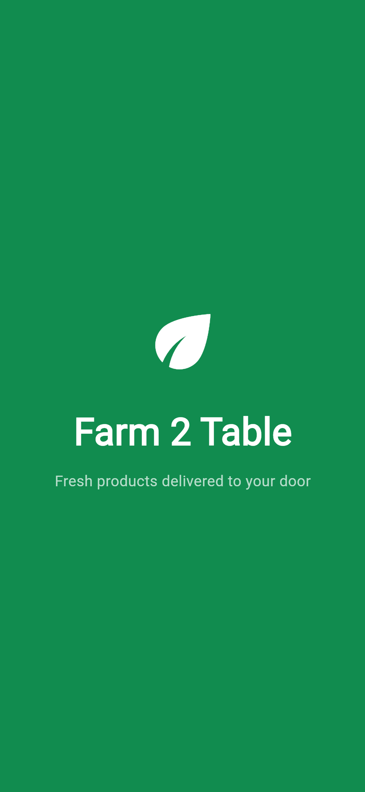
      <br><b>Splash Screen</b>
    </td>
    <td align="center">
      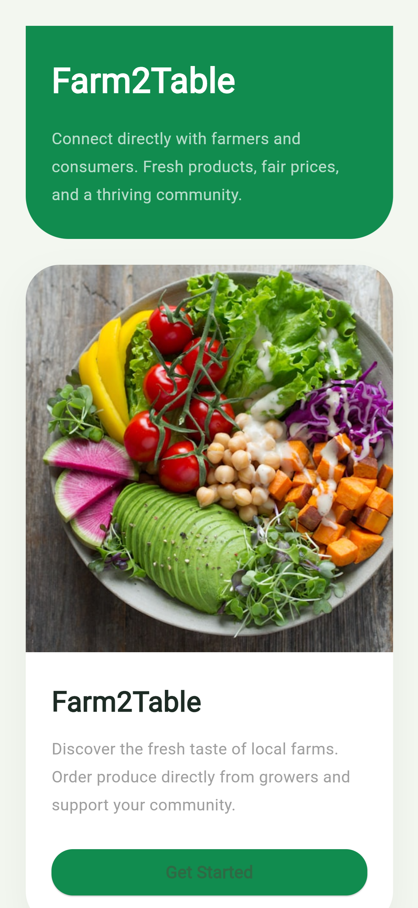
      <br><b>Onboarding</b>
    </td>
  </tr>
</table>

### Authentication
<table>
  <tr>
    <td align="center">
      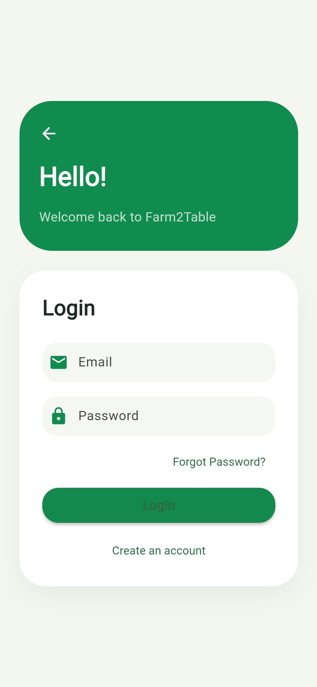
      <br><b>Login</b>
    </td>
  </tr>
</table>

### Shopping Features
<table>
  <tr>
    <td align="center">
      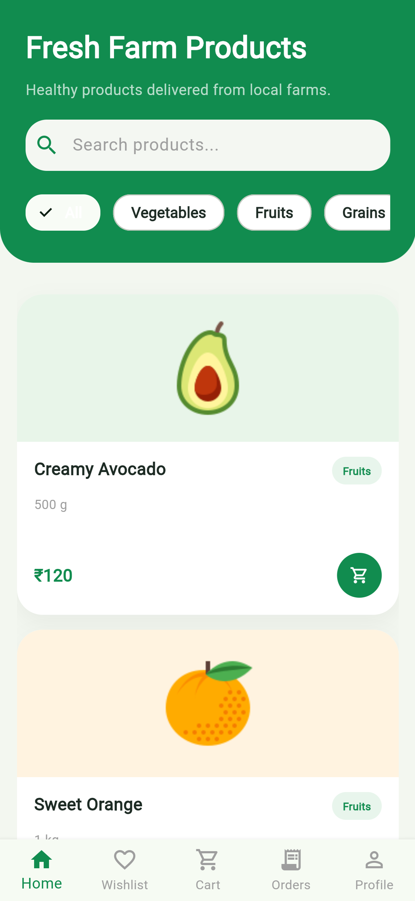
      <br><b>Home</b>
    </td>
    <td align="center">
      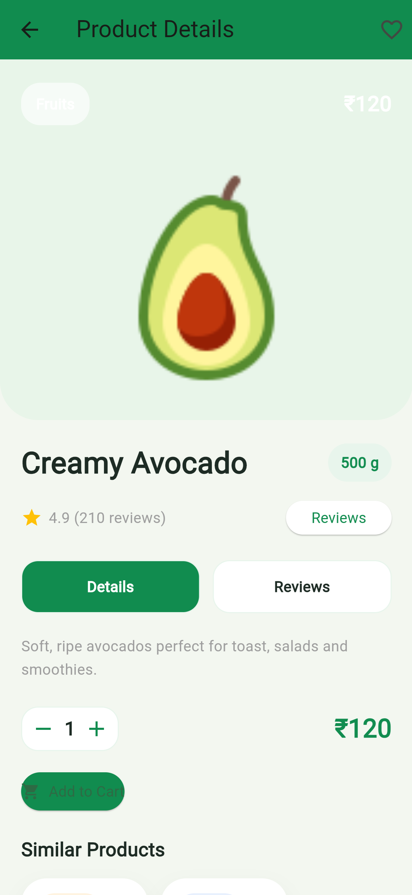
      <br><b>Product Details</b>
    </td>
    <td align="center">
      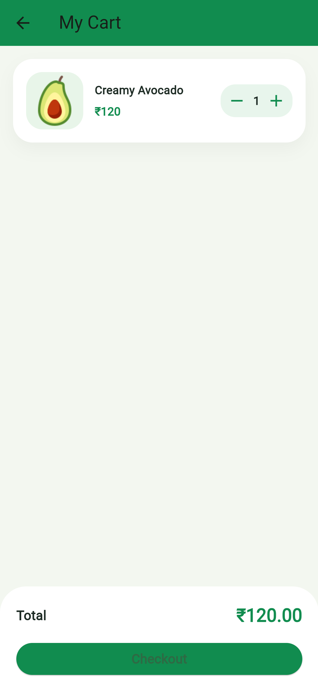
      <br><b>Shopping Cart</b>
    </td>
  </tr>
</table>

### Checkout & Orders
<table>
  <tr>
    <td align="center">
      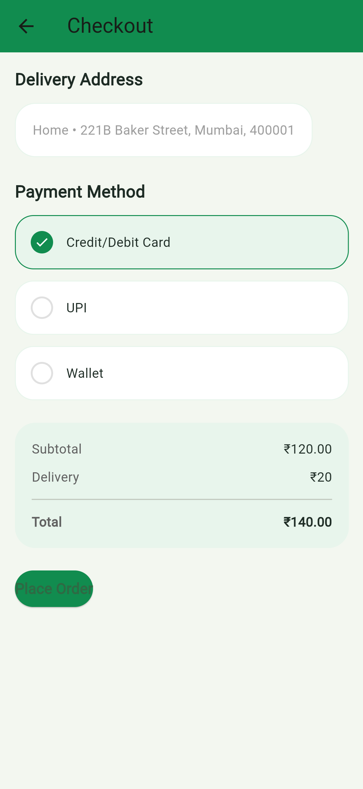
      <br><b>Checkout</b>
    </td>
    <td align="center">
      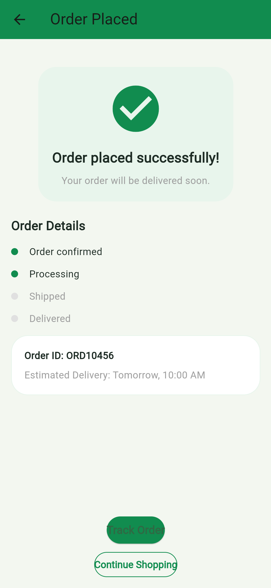
      <br><b>Order Success</b>
    </td>
    <td align="center">
      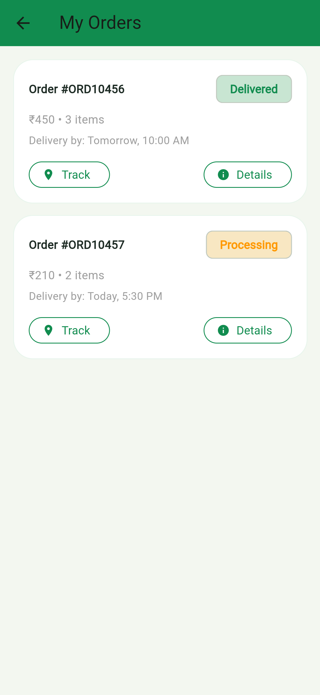
      <br><b>My Orders</b>
    </td>
  </tr>
</table>

### User Profile & Tracking
<table>
  <tr>
    <td align="center">
      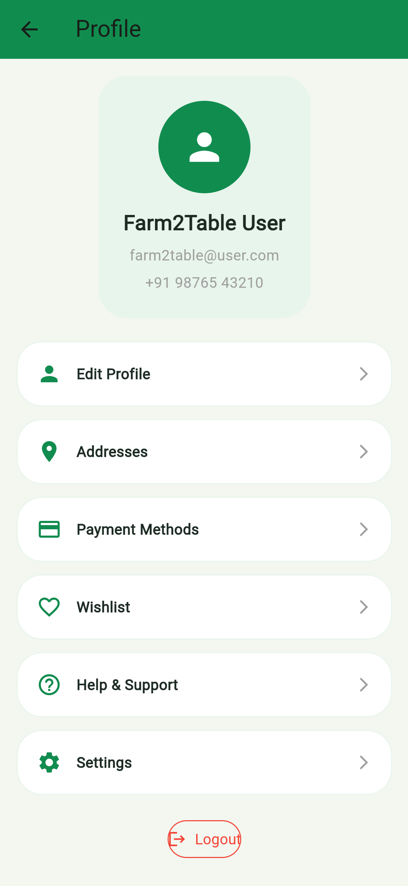
      <br><b>User Profile</b>
    </td>
    <td align="center">
      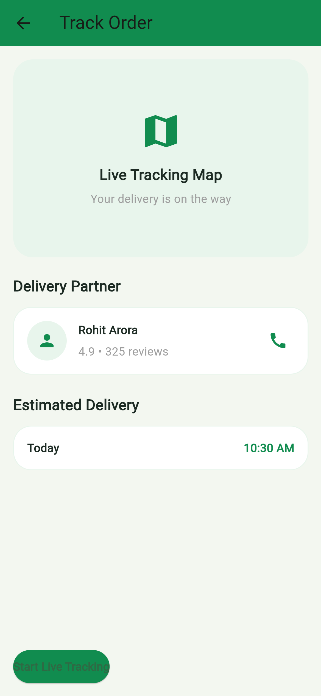
      <br><b>Track Order</b>
    </td>
  </tr>
</table>

## Getting Started

### Prerequisites

- Flutter SDK (latest version)
- Dart SDK
- Android Studio or Xcode
- Git

### Installation

1. Clone the repository:
```bash
git clone https://github.com/yourusername/shopease_ecommerce_app.git
cd shopease_ecommerce_app
```

2. Install dependencies:
```bash
flutter pub get
```

3. Run the app:
```bash
flutter run
```

## Project Structure

```
lib/
├── main.dart                 # Entry point
├── screenshot/               # App screenshots
└── [other folders]          # Additional modules
```

## Technologies Used

- **Flutter** - UI Framework
- **Dart** - Programming Language
- **Firebase/Backend** - Authentication & Data Storage
- **Provider/GetX** - State Management

## Contributing

Contributions are welcome! Please feel free to submit a Pull Request.

## License

This project is licensed under the MIT License - see the LICENSE file for details.

## Support

For support, email your-email@example.com or open an issue on GitHub.

---

**Made with ❤️ using Flutter**
